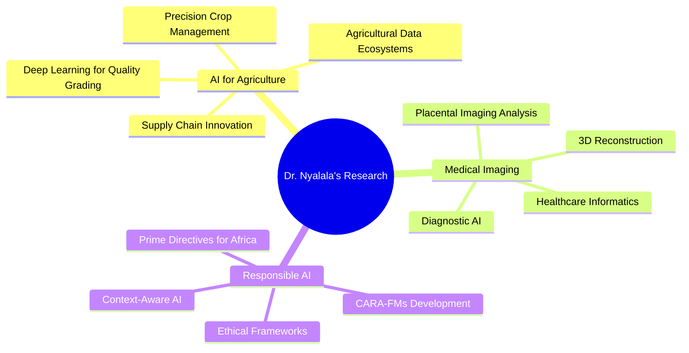

# Hello, I'm Innocent Nyalala

## 🎯 About Me

🔬 **Assistant Professor** at **IIT Madras Zanzibar**  
🌱 **Founding Principal Investigator** of **SAAIL Lab**  
🤖 **AI Researcher** specializing in Agriculture & Healthcare  
🌍 **Transforming East Africa** through ethical AI innovation  
📚 **22+ Publications** with **830+ Citations**  

### 🚀 Current Focus
- 🌾 **AI for Sustainable Agriculture** - Precision crop management and smart farming
- 🏥 **Medical Imaging & Healthcare AI** - Diagnostic tools and assistive technologies  
- ⚖️ **Responsible AI Frameworks** - Ethical AI development for African contexts
- 🎓 **Research Leadership** - Mentoring next generation of AI researchers

---

## 🔥 GitHub Stats

  
  

  

---

## 🛠️ Tech Stack & Expertise

### 💻 Programming Languages

### 🤖 AI/ML Frameworks

### 🔧 Tools & Technologies

---

## 🏆 Research Excellence

### 📊 Research Metrics
| Metric | Value | Impact |
|--------|-------|--------|
| 📚 **Publications** | 22+ | High-impact journals |
| 📈 **Citations** | 830+ | Growing influence |
| 🎯 **h-index** | 13 | Research significance |
| 🔬 **Active Projects** | 6+ | Current innovations |
| 👥 **Students Supervised** | 3 | MTech researchers |

### 🌟 Research Areas

---

## 🌍 Global Collaborations

### 🤝 International Partnerships

| 🏛️ Institution | 🌍 Country | 🔬 Focus Area | 📊 Status |
|----------------|------------|---------------|-----------|
| **Deakin University** | 🇦🇺 Australia | Cotutelle PhD - AI/IoT Agriculture | 🟢 Active |
| **Penn State University** | 🇺🇸 USA | PlacentaVision Medical Imaging | 🟢 Active |
| **Columbia University** | 🇺🇸 USA | AI-driven Air Quality Monitoring | 🟡 Initiating |
| **University of Cambridge** | 🇬🇧 UK | Responsible AI Frameworks | 🟢 Active |
| **Nanjing Agricultural University** | 🇨🇳 China | Agricultural Technology | 🟢 Ongoing |

---

## 🚀 Featured Projects

### 🌾 SAAIL Lab - Sustainable AI for Agriculture & Intelligent Livelihoods

*Leading research laboratory at IIT Madras Zanzibar focusing on transformative AI solutions for East Africa*

**Key Projects:**
- 🌿 **Deep Learning for Zanzibar Cloves** - Quality grading using computer vision
- 🏥 **Placental Imaging AI** - Medical diagnostics for neonatal care
- 👁️ **E-Vision Assistive Tech** - AI for visually impaired individuals
- 🔗 **Blockchain Spice Supply Chain** - Traceability for agricultural products

---

## 📚 Recent Publications

### 🏆 High-Impact Research (2024)

📄 **"Advanced Deep Learning for Cassava Disease Detection"**  
*Artificial Intelligence in Agriculture* (IF: 8.2) | 🔗 [Read Paper](https://scholar.google.com/citations?user=jYVzIZUAAAAJ&hl=en)

📄 **"3D Reconstruction for Poultry Processing Applications"**  
*Journal of Food Engineering* (IF: 5.3) | 🔗 [Read Paper](https://scholar.google.com/citations?user=jYVzIZUAAAAJ&hl=en)

📄 **"Signal Modulation Techniques in Agricultural AI"**  
*Computers and Electronics in Agriculture* (IF: 7.7) | 🔗 [Read Paper](https://scholar.google.com/citations?user=jYVzIZUAAAAJ&hl=en)

---

## 🎓 Academic Leadership

### 👥 Current Research Students

| 🎓 Student | 🔬 Research Focus | 📊 Status |
|------------|------------------|-----------|
| **Patrick Vincent Ndowo** | Deep Learning for Zanzibar Cloves Quality Grading | 🟢 Active |
| **Twamaa Hababuu Makame** | Placental Weight & Volume Estimation from 2D Ultrasound | 🟢 Active |
| **Shivam Vyas** | E-Vision: Intelligent Assistive Application for Visually Impaired | 🟢 Active |

### 🏛️ Administrative Excellence
- 💻 **In-Charge of Computing Resources** - IIT Madras Zanzibar
- 📋 **MTech Project Committee Member** - Academic oversight
- 👥 **Faculty Recruitment Committee** - Strategic hiring

---

## 🌟 Connect & Collaborate

### 📞 Let's Connect!

### 🌐 Professional Networks

---

## 🎯 Current Opportunities

### 🤝 Collaboration Opportunities

🔬 **Research Partnerships** - Joint projects and funding applications  
🎓 **Student Exchange** - International PhD and MTech programs  
🏭 **Industry Collaboration** - Technology transfer and innovation  
🎤 **Conference Speaking** - Keynotes and technical presentations  

### 📧 Contact for:
- Research collaborations in AI for Agriculture
- PhD/MTech supervision opportunities  
- Industry partnerships and consulting
- Speaking engagements and workshops

---

## 🌱 "Transforming East African agriculture through ethical AI innovation" 🌱

### 🏛️ IIT Madras Zanzibar | 🔬 SAAIL Lab | 🌍 East Africa

**© 2024 Dr. Innocent Nyalala - Bridging cutting-edge technology with real-world impact**

